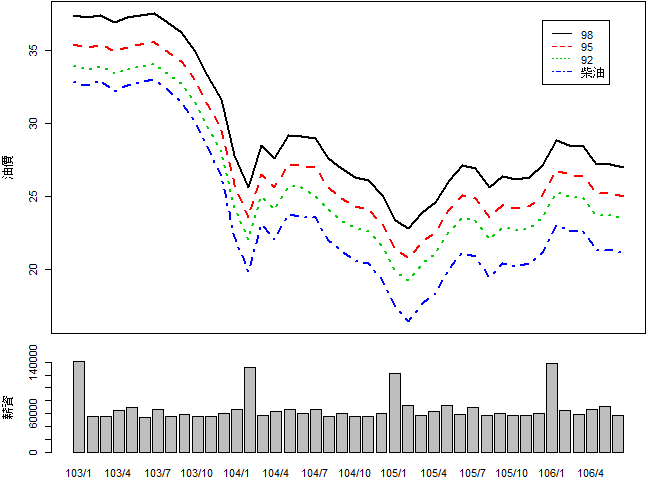
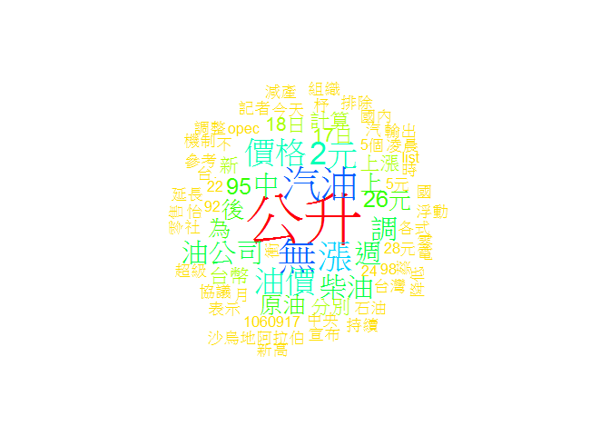

R軟體簡介
================

What?
-----

-   R軟體是基於S語言所建構而成的一套自由軟體，最初由Ross Ihaka及Robert Gentleman所開發。
-   被廣泛用於資料處理、統計分析、圖形繪製等功能的平台。
-   目前最新版本：R 3.4.x；套件數量已超過一萬個(指數增加中)。
-   R軟體可安裝於Windows、MacOS、Linux作業系統。

[](20170918_files/number_of_R_packages.png)

R軟體網站 – <http://www.r-project.org/>

Why?
----

-   程式功能完整、擴充性強
-   提供各主流作業系統的執行環境
-   豐富的討論及教學文件
-   強大的繪圖功能
-   快速銜接最新技術
-   支援其他程式語言如：C、Fortran、Python、Java
-   自由
-   **免費！**

[](20170918_files/kdnuggets.jpg)

When?
-----

[CRAN Task Views](http://cran.csie.ntu.edu.tw/web/views/)

Who?
----

**任何有資料分析需求的人**

R只是一個工具！

相關軟體安裝設定
----------------

### 安裝R軟體

-   R軟體網站 - <http://www.r-project.org/>
-   點選左側選單中的『Download, Packages → CRAN』
-   選擇任一鏡像站(建議選擇位於臺灣的鏡像站)
-   根據作業系統選擇合適的連結下載最新版的R軟體
-   進行安裝 → always 『NEXT』
-   開始使用R軟體

### 安裝RStudio

-   RStudio網站 - <http://www.rstudio.com/>
-   點選RStudio → Download
-   最下方根據作業系統選擇合適的版本
-   進行安裝 → always 『NEXT』
-   開始使用RStudio

功能展示
--------

[油價18日起漲2角 95無鉛飆上26元](http://www.cna.com.tw/news/firstnews/201709170062-1.aspx)

### 歷史油價資訊

``` r
dat = read.csv("20170918_files/data.csv")
par(mar=c(2.1, 4.1, 0.1, 2.1))
layout(matrix(c(1,1,1,2), 4, 1))
matplot(dat[3:6], type="l", lwd=2, ylab="油價", xaxt="n")
legend(36, 37, col=1:4, lty=1:4, legend=c("98","95","92","柴油"))
barplot(dat[,2], ylab="新資", names.arg=dat[,1])
```



### 新聞文字雲

``` r
library(tm)
```

    ## Loading required package: NLP

``` r
library(tmcn)
```

    ## # tmcn Version: 0.2-8

``` r
library(Rwordseg)
```

    ## Loading required package: rJava

    ## # Version: 0.2-1

    ## 
    ## Attaching package: 'Rwordseg'

    ## The following objects are masked from 'package:tmcn':
    ## 
    ##     insertWords, segmentCN

``` r
library(wordcloud)
```

    ## Loading required package: RColorBrewer

``` r
d.corpus <- Corpus(DirSource("20170918_files/doc"), list(language = NA))
d.corpus <- tm_map(d.corpus, segmentCN, nature = TRUE)
d.corpus <- tm_map(d.corpus, removeWords, stopwordsCN())
d.corpus <- Corpus(VectorSource(d.corpus))
tdm <- TermDocumentMatrix(d.corpus, control = list(wordLengths = c(2, Inf)))
m1 <- as.matrix(tdm)
v <- sort(rowSums(m1), decreasing = TRUE)
d <- data.frame(word = names(v), freq = v)
wordcloud(d$word, d$freq, min.freq = 2, random.order = F, ordered.colors = F, 
          colors = rainbow(length(row.names(m1))))
```


