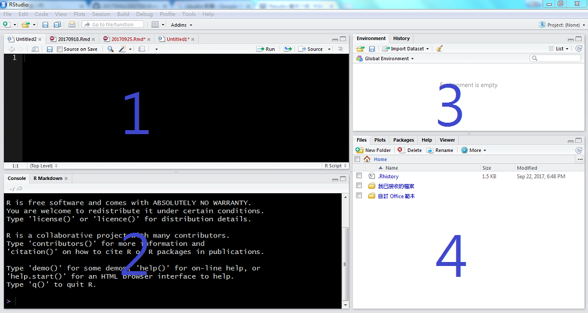

```{r setup, include=FALSE}
knitr::opts_chunk$set(echo = TRUE)
```

## RStudio環境導覽



1. 程式撰寫區
2. 主控台(console)
3. 變數環境與歷史撰寫記錄
4. 目錄、圖形、套件、說明......

**撰寫我們的第一支程式**

在程式撰寫區撰寫R語言 → 'Ctrl + Enter' (Mac: 'Command + Enter')

```{r}
print("Hello, World!")
```

## R基本語法規則

### 簡單的四則運算

```{r, eval=FALSE}
###############################################################
## 在R語言中，井字符號(#)後的任何單行文字都視為註解，不會執行。
###############################################################

## 簡單的數字與字串運算
1 + 2
3 - 4
5 * 6
7 / 8
9 ^ 0  # 次方，等同於9**0
1 + 2 * (3 / 4) ^ 5  # 先乘除後加減，有括號先運算
```

### 變數建立

```{r, eval=FALSE}
## (=) 和 (<-) 皆為R語言的指派(assign)符號
x = 1
y <- 2
z <-3
X = x + y - z  # R語言的大小寫是有差別的
```

### 補充

- [資料屬性](補充_資料屬性.md)
- [變數型態](補充_變數型態.md)
- [指標系統](補充_指標系統.md)

## 函數與套件

### 函數(function)

函數(function)就是將一段程式碼包裝起來，方便後續重複使用。
根據不同的給定參數(arguments)，回傳對應的執行結果。

例如我們想要計算一個數列的加總，我們可以使用**sum**函數。

```{r}
sum(2017, 9, 25)
```

面對一個不熟悉的函數，可以使用help或?來查詢使用說明。
(超級重要！)

```{r, eval=FALSE}
help(sum)  # help本身也是一個函數
?sum  # 執行結果同上
```

### 套件(package)

套件(package)通常是為了某個特定目標，集合許多相關的函數打包而成。
例如stats套件包含了許多統計常用函數；而各種基本繪圖函數則含括在graphics套件內。

除了R內建的基本套件之外，需使用**install.packages**函數來下載並安裝套件。馬上來裝一個R語言非常熱門的ggplot2繪圖套件試試看吧∼

```{r, eval=FALSE}
install.packages("ggplot2")
```

上面只是把套件下載並安裝到自己的電腦上，但我們真正要使用前還要先使用**library**函數載入它，接著才可以使用套件所提供的各種函數。

```{r}
library(ggplot2)
qplot(mpg, wt, data = mtcars, colour = cyl, size = cyl)
```

## 資料匯入及匯出

### 設定工作目錄

工作目錄是R預設的資料、程式存取路徑。
預先設定好工作目錄之後，就不用每次存取檔案都需要輸入完整路徑了。

使用**setwd**函數設定工作目錄(用**getwd**函數查看現行工作目錄)。

```{r, eval=FALSE}
setwd("D:/2017SHU/")  # 路徑的斜線要用(/)或是(\\)
getwd()
```

### 純文字檔匯入

首先當然要先有資料，去[政府資料開放平臺](https://data.gov.tw/)找找吧！

以[大專院校校別學生數](https://data.gov.tw/dataset/6231)為例，使用**read.table**函數讀取資料(read.csv等其他相關函數為read.table函數的延伸)，參數說明請善用**help**功能。

```{r, eval=FALSE}
student = read.table("105_student.csv", header=TRUE, sep=",", fileEncoding="UTF-8")
student = read.csv("105_student.csv", fileEncoding="UTF-8")
```

### 匯出純文字檔

有read就有write。使用**write.table**相關函數寫出純文字檔。

```{r, eval=FALSE}
write.table(student, file="student.txt")
write.csv(student, file="student.csv", row.names=FALSE)
```

### 補充

- [存取其他資料格式檔案](補充_存取其他資料格式檔案.md)

## 小試身手

1. 至[政府資料開放平臺](https://data.gov.tw/)找一個自己有興趣的主題資料。
2. 下載CSV檔。
3. 想辦法正確的匯入R。
4. 安裝xlsx套件。
5. 使用xlsx套件的write.xlsx函數把你在step 3匯入的資料寫出成一個excel檔案(.xlsx)。

把你的程式碼存為**學號.R**，夾帶附件mail至[ytshen1207@gmail.com](mailto:ytshen1207@gmail.com)。
信裡面註明你的**姓名**、**學號**以及所使用的**資料檔下載網址**。
