資料視覺化
================

09/25練習題
-----------

``` r
## 1. 至政府資料開放平臺找一個自己有興趣的主題資料。
## 2. 下載CSV檔。
######################################
## 以不動產買賣實價登錄批次資料為例
## https://data.gov.tw/dataset/6213
######################################

## 3. 想辦法正確的匯入R。
lvr = read.csv("A_LVR_LAND_A.csv")

## 4. 安裝xlsx套件。
install.packages("xlsx")

## 5. 使用xlsx套件的write.xlsx函數把你在step3匯入的資料寫出成一個excel檔案(.xlsx)。
library(xlsx)
write.xlsx(lvr, "LVR.xlsx")
```

新聞案例研析
------------

[房市蛋白區跌逾3成 顏炳立：蛋白變黑了](http://www.cna.com.tw/news/afe/201709290109-1.aspx)

下載檔案： <http://ytshen.carra.org.tw/data/A_LVR_LAND_A.csv>

``` r
## 檢視現行工作目錄，把下載的檔案放在工作目錄下
getwd()

## 讀取資料
lvr = read.csv("A_LVR_LAND_A.csv")

## 檢視資料
View(lvr)
```

常見的圖表呈現方式
------------------

### 散佈圖

``` r
plot(lvr$建物移轉總面積平方公尺, lvr$總價元)
```

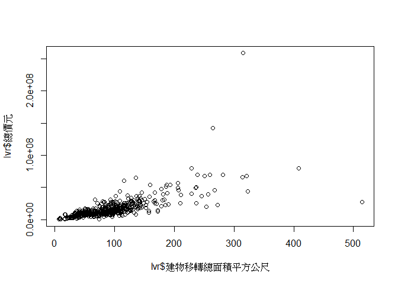

``` r
## 一次畫多個變數的散佈圖
plot(lvr[c("建物現況格局.房", "建物現況格局.廳", "建物現況格局.衛")])
```

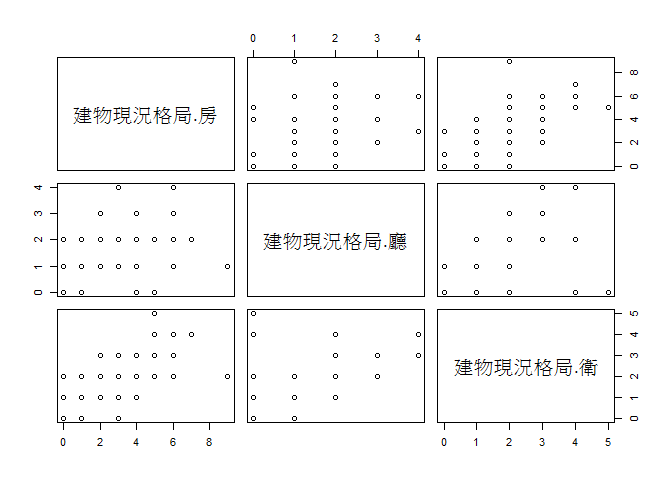

### 直方圖

``` r
hist(lvr$單價每平方公尺)
```

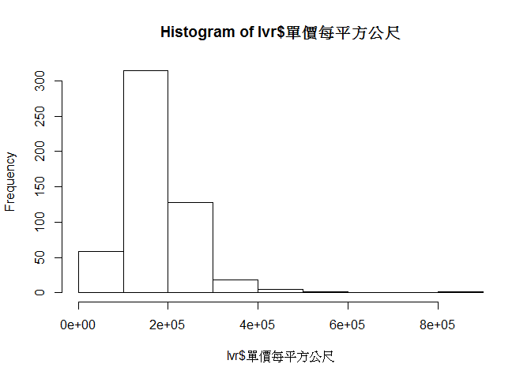

``` r
## 加上陰影線
hist(lvr$單價每平方公尺, density=10)
```


### 折線圖

``` r
## 先把單價依照交易日期排序
price = lvr$單價每平方公尺[order(lvr$交易年月日)]
plot(price, type="l")
```

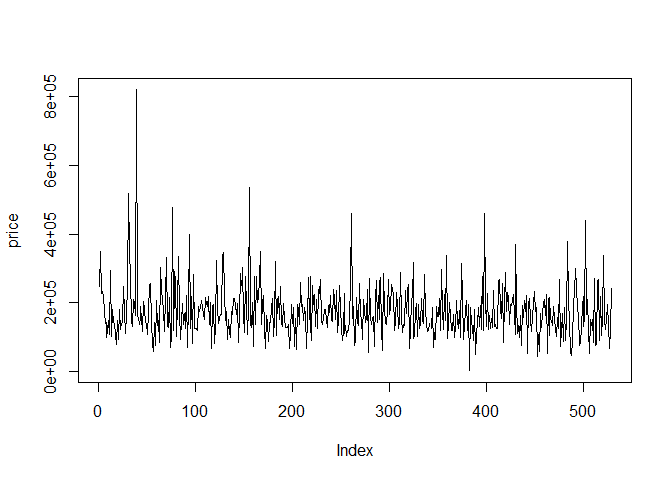

### 長條圖

``` r
## 計算都市土地使用分區匯整數
table1 = table(lvr$都市土地使用分區)
barplot(table1)
```


``` r
## 也可以同時繪製兩個欄位的長條圖
table2 = table(lvr$有無管理組織, lvr$主要用途)
barplot(table2, legend.text=rownames(table2), beside=TRUE,
        xlab="主要用途", ylab="Count")
```

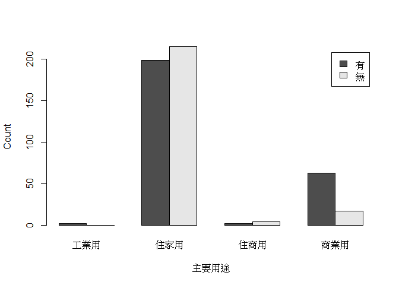

### 圓餅圖

``` r
## 計算鄉鎮市區匯整數
table3 = table(lvr$鄉鎮市區)
pie(table3)
```

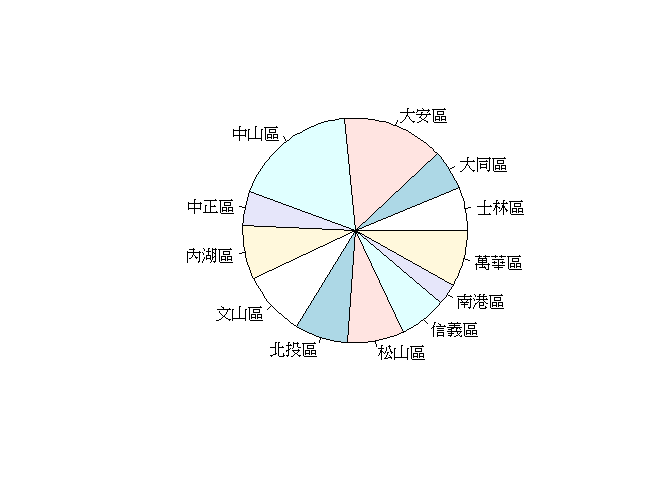

``` r
## 繪製3D圓餅圖
## install.packages("plotrix")
library(plotrix)
pie3D(table3, labels=names(table3), explode=0.1)
```

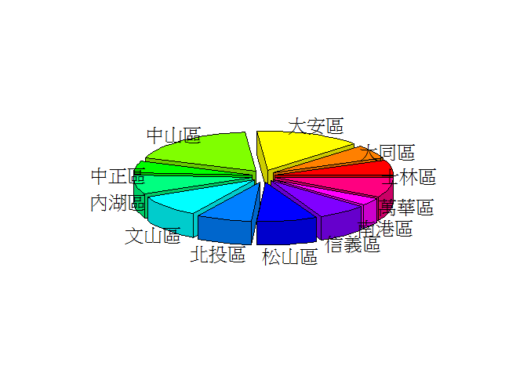

常用圖形參數設定
----------------

### 圖點(pch, cex)

``` r
par(mar = c(1,1,1,1))
plot(   x = c(rep(1,5),rep(2,5),rep(3,5),rep(4,5),rep(5,5)),
    y = rep(5:1,5),
    axes = F,
    xlab = "",ylab = "",
    xlim = c(1,6),ylim = c(1,5),
    pch = 1:25,
    bg = "red",cex = 3)
text(   x = c(rep(1,5),rep(2,5),rep(3,5),rep(4,5),rep(5,5))+.5,
    y = rep(5:1,5),
    labels = as.character(1:25))
abline(h = (1:5)+0.5,col = "grey")
abline(v = (1:5)+0.75,col = "grey")
```

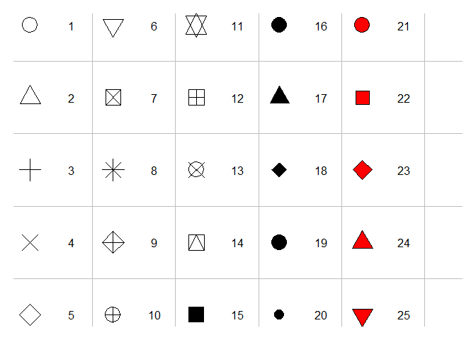

``` r
## 改變圖點的樣式及大小
plot(lvr$建物移轉總面積平方公尺, lvr$總價元,
     pch=18, cex=2)
```

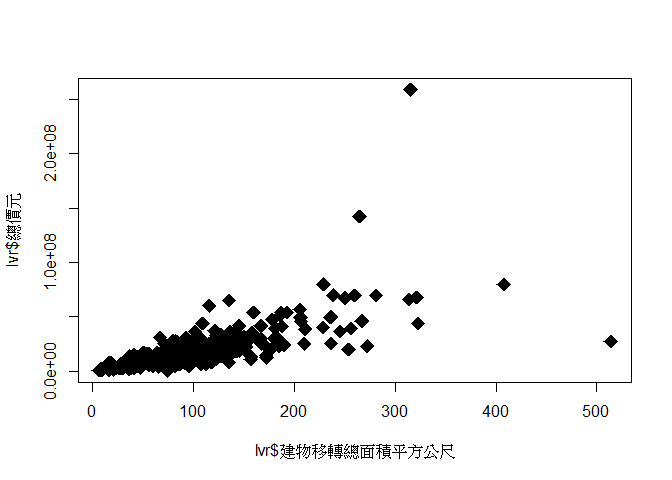

``` r
## 也可以自訂圖點樣式
plot(lvr$建物移轉總面積平方公尺, lvr$總價元, pch="沈")
```

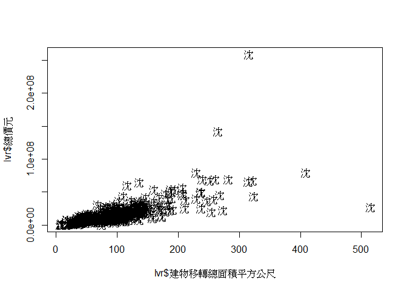

### 線條(lty, lwd)

``` r
par(mar = c(1,1,1,1))
a<-c(1,0,1,1)
plot(   1,1,
    type = "n",
    xlim = c(1,4),ylim = c(0,6),
    axes = F,
    xlab = "",ylab = "")
matlines(   x = 1:4,
    y = cbind(a,a+1,a+2,a+3,a+4,a+5),
    col = "black",
    lty = 1:6,
    lwd = 2)
text(   x = rep(2,6),
    y = (1:6)-0.75,
    labels = as.character(1:6))
box()
```

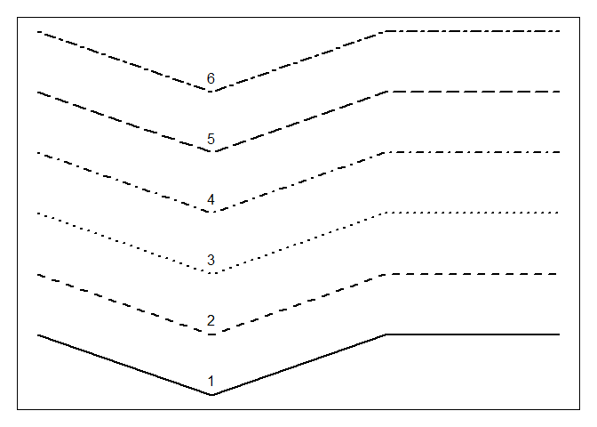

``` r
## 改變線條的樣式及寬度
plot(price, type="l",
     lty=2, lwd=4)
```

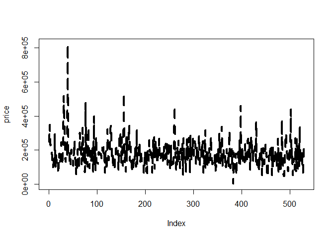

### 顏色(col, bg)

``` r
par(mar = c(1,1,1,1))
barplot(rep(1,8),col = 1:8,space = 0,axes = F)
text((1:4)-0.5,rep(0.5,4),as.character(1:4),col = "white")
text((5:8)-0.5,rep(0.5,4),as.character(5:8),col = "black")
```

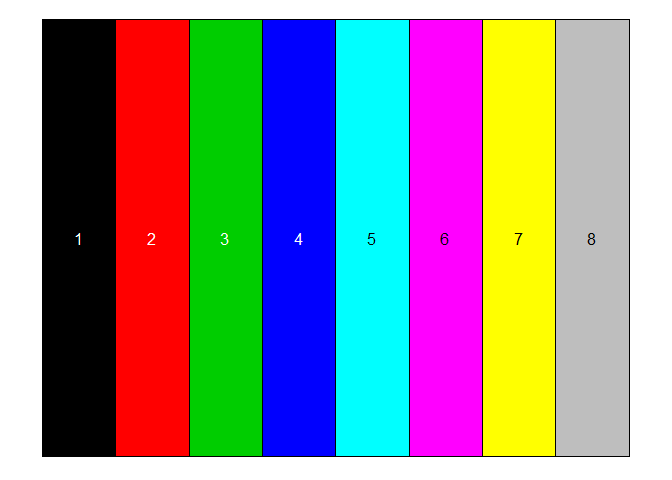

``` r
## 加上背景顏色
par(bg=8)

## 加上顏色
hist(lvr$單價每平方公尺, col=6)
```

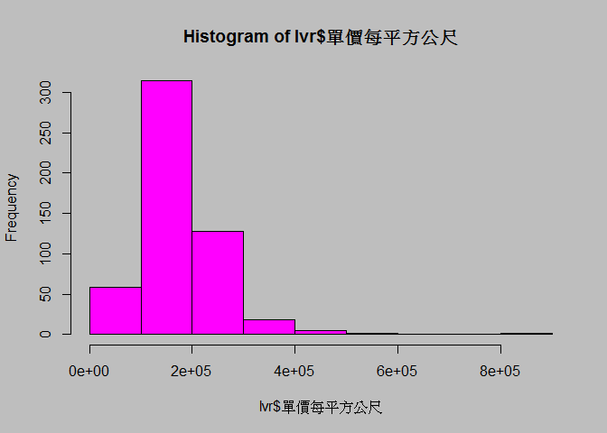

``` r
## 也可以使用顏色名稱
hist(lvr$單價每平方公尺, col="orange")
```

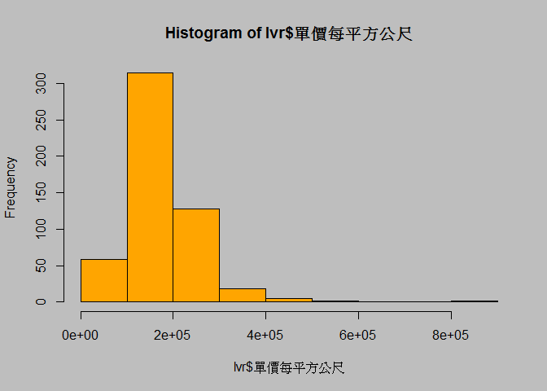

``` r
## 也可以使用hex color
hist(lvr$單價每平方公尺, col="#4286f4")
```

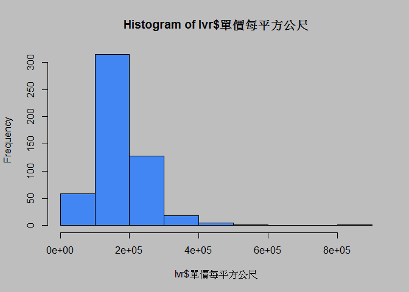

### 標籤(main, sub, xlab, ylab)

``` r
## 加上標題及標籤
barplot(table1,
        main="長條圖(Bar Plot)", sub="子標題不知道要寫什麼",
        xlab="都市土地使用分區", ylab="Count")
```

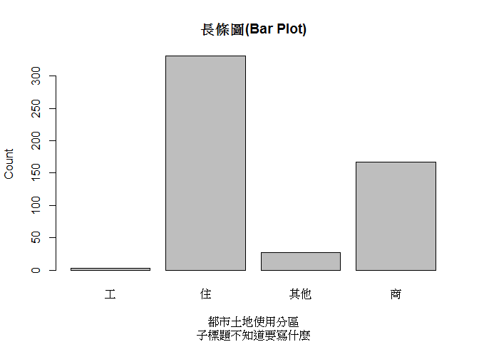

補充 - 盒鬚圖
-------------

``` r
boxplot(單價每平方公尺 ~ 鄉鎮市區, data=lvr, las=2)
```

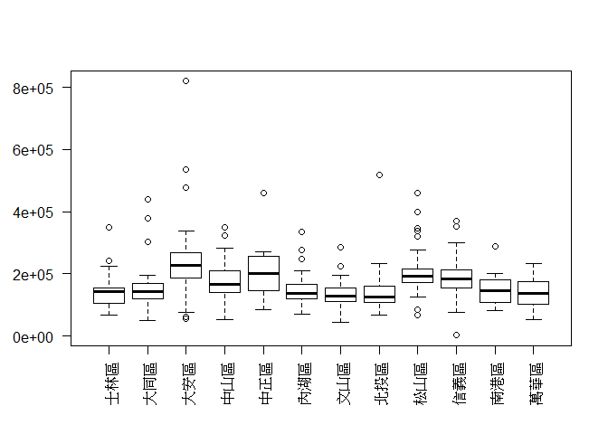
