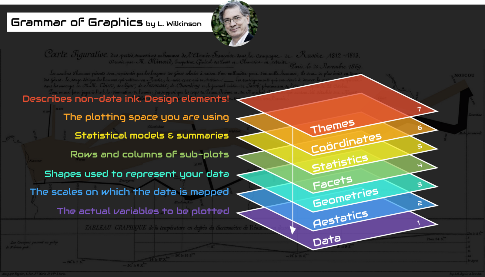
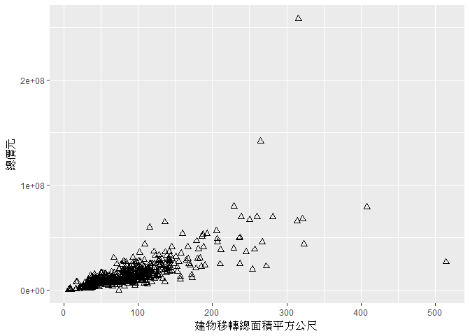
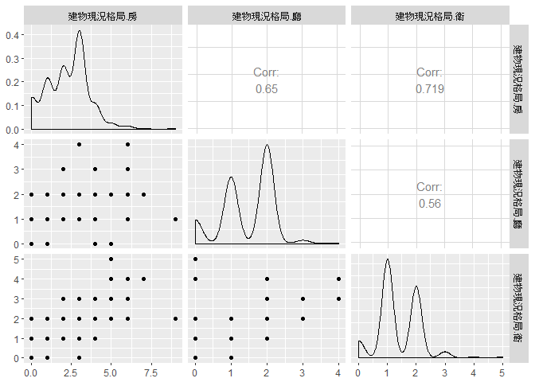
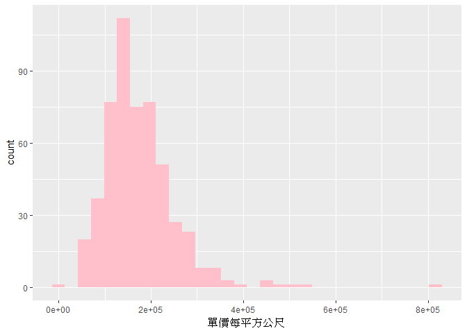
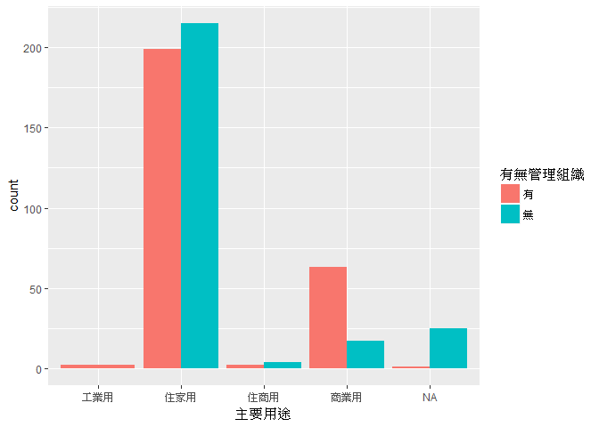
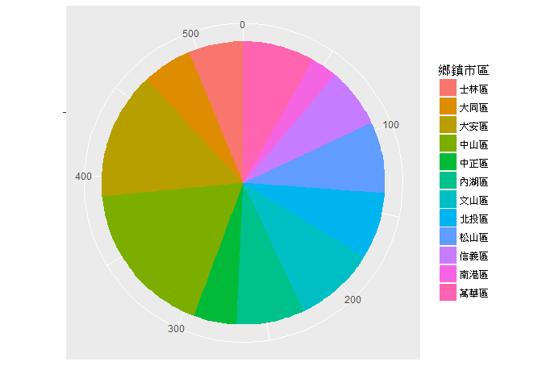
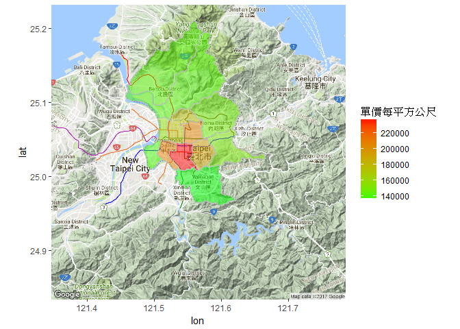

資料視覺化
================

Install rJava package on Mac
----------------------------

1.  [開啟Mac的Terminal終端機](http://www.macbookone.com/2010/06/mac-terminal.html)
2.  [設定java環境](https://www.ibm.com/support/knowledgecenter/SSPT3X_3.0.0/com.ibm.swg.im.infosphere.biginsights.install.doc/doc/install_install_r.html)

Grammar of Graphics
-------------------



ggplot2
-------

[Reference](http://ggplot2.tidyverse.org/reference/)

``` r
## 下載資料
## http://ytshen.carra.org.tw/data/A_LVR_LAND_A.csv

## 讀取資料
lvr = read.csv("A_LVR_LAND_A.csv", fileEncoding="BIG5")

## 安裝並載入ggplot2套件
## install.packages("ggplot2")
library(ggplot2)
```

### 散佈圖

``` r
ggplot(data=lvr, aes(x=建物移轉總面積平方公尺, y=總價元)) +
  geom_point(size=2, shape=2)
```



``` r
## 一次畫多個變數的散佈圖
## install.packages("GGally")
library(GGally)
ggpairs(lvr[c("建物現況格局.房", "建物現況格局.廳", "建物現況格局.衛")])
```



### 直方圖

``` r
ggplot(data=lvr, aes(x=單價每平方公尺))+
  geom_histogram(fill="pink")
```



### 折線圖

``` r
ggplot(lvr, aes(x=rank(交易年月日, ties.method="random"), y=單價每平方公尺))+
  geom_line(size=2, linetype=2)
```


### 長條圖

``` r
ggplot(lvr, aes(x=都市土地使用分區)) +
  geom_bar() +
  labs(title="長條圖(Bar Plot)", subtitle="子標題不知道要寫什麼")
```


``` r
## 也可以同時繪製兩個欄位的長條圖
ggplot(lvr, aes(x=主要用途, fill=有無管理組織)) +
  geom_bar(position="dodge")
```



### 圓餅圖

``` r
ggplot(lvr, aes(x="", fill=鄉鎮市區)) +
  geom_bar(width=1) +
  coord_polar("y") +
  labs(x="", y="")
```



### 補充 - 盒鬚圖

``` r
## 各種繪圖文法的組合應用
ggplot(lvr, aes(x=鄉鎮市區, y=單價每平方公尺)) +
  geom_jitter(col="orange") +
  facet_grid(有無管理組織 ~ .) +
  stat_boxplot(fill="#4286f4") +
  coord_flip() +
  theme_light()
```


地圖
----

圖資來源：[鄉鎮市區界線](https://data.gov.tw/dataset/7441)

``` r
## 安裝並載入ggmap套件
## install.packages("ggmap")
library(ggmap)

## 載入台北行政區圖資
## http://ytshen.carra.org.tw/data/taipei.csv
taipei = read.csv("taipei.csv", fileEncoding="BIG5")

## 計算各區平均房價並與座標資料合併
price = tapply(lvr$單價每平方公尺, lvr$鄉鎮市區, mean, na.rm=TRUE)
df = data.frame(鄉鎮市區=names(price), 單價每平方公尺=price)
dat = merge(taipei, df)

## 從Google獲取背景地圖
map = get_googlemap(center='Taipei', zoom=11)
ggmap(map) +
  geom_polygon(aes(x=long, y=lat, group=鄉鎮市區, fill=單價每平方公尺),
               data=dat, colour="grey", alpha=0.5) +
  scale_fill_gradient(low="green", high="red")
```



小試身手
--------

1.  使用R內建的**mtcars**資料檔。
2.  繪製有意義的統計圖，種類、樣式、方法皆不限。
3.  針對繪製的圖表解釋其**意義**。

把你的程式碼存為**學號.R**，夾帶附件mail至<ytshen1207@gmail.com>。 信裡面註明你的**姓名、學號**以及**繪圖結果的解釋**。
