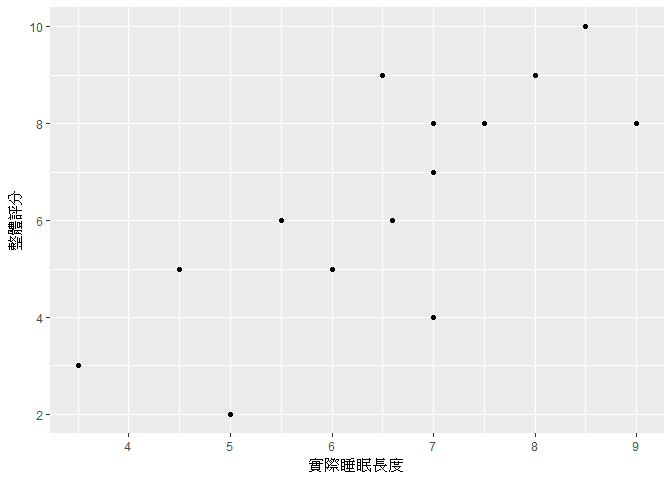

預測模型
================

10/16練習題
-----------

``` r
## 1. 使用R內建的mtcars資料檔。
## 2. 繪製有意義的統計圖，種類、樣式、方法皆不限。
## 3. 針對繪製的圖表解釋其意義。

library(ggplot2)
ggplot(mtcars, aes(x=wt, y=qsec, col=mpg)) +
  geom_point(size=2) +
  facet_grid(am ~ .) +
  labs(x="車重(千磅)", y="車行1/4英里花費秒數") +
  theme_bw()
```


由圖形可以看出自排車(am=0)的重量普遍高於手排車(am=1)； 車子越重，油耗(mpg)自然也越高。 小於2000磅重的輕型車每加侖油量可行駛超過30英里； 大於5000磅重的大型車每加侖油量僅可行駛不到15英里。 整體而言，自排車多屬重型高油耗，手排車則多為輕型低油耗。 車速方面則無明顯差異。

新聞案例研析
------------

[睡不好是老化徵兆，研究指40歲睡眠腦波開始減弱](https://technews.tw/2017/10/20/sleep-problem-in-aging/)

睡眠品質調查： <https://goo.gl/forms/9dgo5a9fIqAS0T8Q2>

下載檔案： <https://docs.google.com/spreadsheets/d/1tGQHE3rO-KAyHNDkrIMoWDOuG7MVdH6uabMatruUEKo/export?format=csv>

``` r
## 檢視現行工作目錄，把下載的檔案放在工作目錄下
getwd()

## 讀取資料
sleep = read.csv("SHU20171023 - response.csv", fileEncoding="UTF-8")

## 檢視資料
View(sleep)
```

相關係數
--------

進行分析之前，可以用以前學過的繪圖技巧先大致看一下我們感興趣的變數的分佈情況：

``` r
## 載入ggplot2套件
library(ggplot2)

## 實際睡眠長度 vs 整體評分散佈圖
ggplot(sleep, aes(x=實際睡眠長度, y=整體評分)) +
  geom_point()
```



可以看到實際睡眠長度越長，對於自己睡眠品質的評分也大致越高，也就是兩者之間似乎呈現**正相關**。

然而用圖形呈現的判斷方式畢竟比較主觀，那麼是否有一個比較客觀的指標可以來解釋兩者的相關性？ 我們可以使用**相關係數**來解決這個問題：

``` r
## Pearson相關係數
cor(sleep$實際睡眠長度, sleep$整體評分)
```

    ## [1] 0.7745474

相關係數會介於-1至1之間。越接近-1表示兩變數之間負相關程度越高；越接近1表示正相關程度越高；若接近0則表示沒有**線性**相關。

補充 - 相關係數的陷阱
---------------------

-   Pearson相關係數容易受極端值影響：

``` r
## 新增一筆資料(睡了20小時但是僅給予1分評分)
實際睡眠長度 = c(sleep$實際睡眠長度, 20)
整體評分 = c(sleep$整體評分, 1)

## 散佈圖
qplot(x=實際睡眠長度, y=整體評分)
```


``` r
## Pearson相關係數
cor(實際睡眠長度, 整體評分)
```

    ## [1] -0.2174953

-   猜猜哪個圖的相關係數為0？


簡單線性迴歸分析
----------------

我們已經可以透過相關係數來了解變數間的相關性，接下來要進一步探討兩者之間的影響力甚至進行預測。

我們的目標是找到一條線(模型)，讓每個資料點跟這條線之間的誤差總合最小化：


``` r
## 簡單線性迴歸模型
fit = lm(整體評分 ~ 實際睡眠長度, data=sleep)

## 模型摘要
summary(fit)
```

    ## 
    ## Call:
    ## lm(formula = 整體評分 ~ 實際睡眠長度, data = sleep)
    ## 
    ## Residuals:
    ##     Min      1Q  Median      3Q     Max 
    ## -2.9838 -0.6354  0.2582  0.9252  2.6222 
    ## 
    ## Coefficients:
    ##              Estimate Std. Error t value Pr(>|t|)    
    ## (Intercept)   -1.5003     1.8470  -0.812 0.431254    
    ## 實際睡眠長度   1.2120     0.2745   4.415 0.000698 ***
    ## ---
    ## Signif. codes:  0 '***' 0.001 '**' 0.01 '*' 0.05 '.' 0.1 ' ' 1
    ## 
    ## Residual standard error: 1.527 on 13 degrees of freedom
    ## Multiple R-squared:  0.5999, Adjusted R-squared:  0.5691 
    ## F-statistic: 19.49 on 1 and 13 DF,  p-value: 0.0006979

``` r
## 迴歸線
ggplot(sleep, aes(x=實際睡眠長度, y=整體評分)) +
  geom_point() +
  geom_smooth(method="lm")
```


多元線性迴歸分析
----------------

``` r
## 多元線性迴歸模型
fit2 = lm(整體評分 ~ 年齡 + 性別 + 入睡需時 + 實際睡眠長度 +
               中途醒來次數 + 賴床時間 + 白天睡眠時間 + 是否有失眠困擾, data=sleep)

## 模型摘要
summary(fit2)
```

    ## 
    ## Call:
    ## lm(formula = 整體評分 ~ 年齡 + 性別 + 入睡需時 + 實際睡眠長度 + 
    ##     中途醒來次數 + 賴床時間 + 白天睡眠時間 + 是否有失眠困擾, 
    ##     data = sleep)
    ## 
    ## Residuals:
    ##     Min      1Q  Median      3Q     Max 
    ## -1.0591 -0.3215 -0.1128  0.3157  0.9315 
    ## 
    ## Coefficients:
    ##                   Estimate Std. Error t value Pr(>|t|)  
    ## (Intercept)       7.400106   2.055892   3.599   0.0114 *
    ## 年齡             -0.048079   0.023684  -2.030   0.0887 .
    ## 性別男           -0.159650   0.518085  -0.308   0.7684  
    ## 入睡需時         -0.040759   0.014080  -2.895   0.0275 *
    ## 實際睡眠長度      0.354046   0.264704   1.338   0.2295  
    ## 中途醒來次數      0.086334   0.385714   0.224   0.8303  
    ## 賴床時間         -0.009575   0.030960  -0.309   0.7676  
    ## 白天睡眠時間      0.007361   0.008471   0.869   0.4182  
    ## 是否有失眠困擾是 -1.311200   0.661656  -1.982   0.0948 .
    ## ---
    ## Signif. codes:  0 '***' 0.001 '**' 0.01 '*' 0.05 '.' 0.1 ' ' 1
    ## 
    ## Residual standard error: 0.8618 on 6 degrees of freedom
    ## Multiple R-squared:  0.9412, Adjusted R-squared:  0.8627 
    ## F-statistic:    12 on 8 and 6 DF,  p-value: 0.003559
