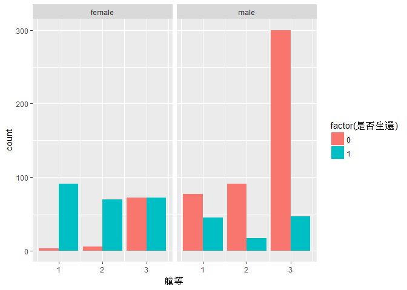
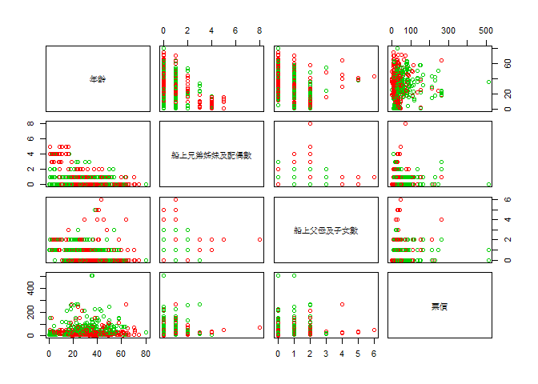
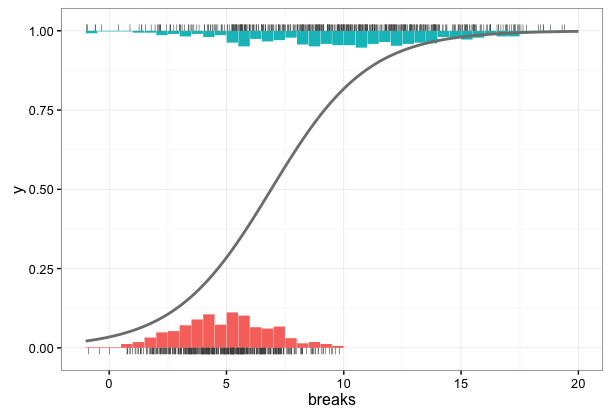
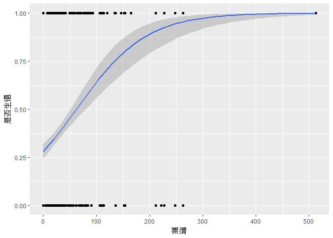

預測模型
================

新聞案例研析
------------

[李奧擔心不已！凱特溫絲蕾三跳冰湖凍僵了](http://www.appledaily.com.tw/realtimenews/article/new/20171027/1229628/)

下載檔案： <http://ytshen.carra.org.tw/data/titanic.csv>

資料來源： [Kaggle](https://www.kaggle.com/c/titanic)

``` r
## 檢視現行工作目錄，把下載的檔案放在工作目錄下
getwd()

## 讀取資料
titanic = read.csv("titanic.csv", fileEncoding="UTF-8")

## 檢視資料
View(titanic)
```

描述性統計
----------

進行分析之前，可以用一些摘要統計和繪圖技巧先大致看一下我們感興趣的變數的分佈情況：

``` r
## 資料摘要
summary(titanic)
```

    ##     是否生還           艙等           性別          年齡      
    ##  Min.   :0.0000   Min.   :1.000   female:314   Min.   : 0.42  
    ##  1st Qu.:0.0000   1st Qu.:2.000   male  :577   1st Qu.:20.12  
    ##  Median :0.0000   Median :3.000                Median :28.00  
    ##  Mean   :0.3838   Mean   :2.309                Mean   :29.70  
    ##  3rd Qu.:1.0000   3rd Qu.:3.000                3rd Qu.:38.00  
    ##  Max.   :1.0000   Max.   :3.000                Max.   :80.00  
    ##                                                NA's   :177    
    ##  船上兄弟姊妹及配偶數 船上父母及子女數      票價       
    ##  Min.   :0.000        Min.   :0.0000   Min.   :  0.00  
    ##  1st Qu.:0.000        1st Qu.:0.0000   1st Qu.:  7.91  
    ##  Median :0.000        Median :0.0000   Median : 14.45  
    ##  Mean   :0.523        Mean   :0.3816   Mean   : 32.20  
    ##  3rd Qu.:1.000        3rd Qu.:0.0000   3rd Qu.: 31.00  
    ##  Max.   :8.000        Max.   :6.0000   Max.   :512.33  
    ## 

``` r
## 載入ggplot2套件
library(ggplot2)

## 類別變數 vs 是否生還長條圖
ggplot(titanic, aes(x=艙等, fill=factor(是否生還))) +
  geom_bar(position="dodge") +
  facet_grid(. ~ 性別)
```



``` r
## 數值變數 vs 是否生還散佈圖
## 第4~7個變數為數值變數，是否生還為0,1二元變數，加2後分別為2(否，紅色)、3(是，綠色)
plot(titanic[4:7], col=titanic$是否生還+2)
```



可以看出**艙等**、**性別**、**票價**等可能都是影響生還機會的重要因素。

簡單羅吉斯迴歸分析
------------------

描述性統計的解釋終究較為主觀，接下來進一步利用統計模型探討影響生還機會的重要因子甚至進行預測。

我們可以使用羅吉斯迴歸(Logistic regression)進行分析預測：



``` r
## 簡單羅吉斯迴歸模型
fit = glm(是否生還 ~ 票價, data=titanic, family="binomial")

## 模型摘要
summary(fit)
```

    ## 
    ## Call:
    ## glm(formula = 是否生還 ~ 票價, family = "binomial", data = titanic)
    ## 
    ## Deviance Residuals: 
    ##     Min       1Q   Median       3Q      Max  
    ## -2.4906  -0.8878  -0.8531   1.3429   1.5942  
    ## 
    ## Coefficients:
    ##              Estimate Std. Error z value Pr(>|z|)    
    ## (Intercept) -0.941330   0.095129  -9.895  < 2e-16 ***
    ## 票價         0.015197   0.002232   6.810 9.79e-12 ***
    ## ---
    ## Signif. codes:  0 '***' 0.001 '**' 0.01 '*' 0.05 '.' 0.1 ' ' 1
    ## 
    ## (Dispersion parameter for binomial family taken to be 1)
    ## 
    ##     Null deviance: 1186.7  on 890  degrees of freedom
    ## Residual deviance: 1117.6  on 889  degrees of freedom
    ## AIC: 1121.6
    ## 
    ## Number of Fisher Scoring iterations: 4

``` r
## 迴歸線
ggplot(titanic, aes(x=票價, y=是否生還)) +
  geom_point() +
  geom_smooth(method="glm", method.args=list(family="binomial"))
```



多元羅吉斯迴歸分析
------------------

``` r
## 多元羅吉斯迴歸模型
fit2 = glm(是否生還 ~ ., data=titanic, family="binomial")

## 模型摘要
summary(fit2)
```

    ## 
    ## Call:
    ## glm(formula = 是否生還 ~ ., family = "binomial", data = titanic)
    ## 
    ## Deviance Residuals: 
    ##     Min       1Q   Median       3Q      Max  
    ## -2.7953  -0.6476  -0.3847   0.6271   2.4433  
    ## 
    ## Coefficients:
    ##                       Estimate Std. Error z value Pr(>|z|)    
    ## (Intercept)           5.389003   0.603734   8.926  < 2e-16 ***
    ## 艙等                 -1.242249   0.163191  -7.612 2.69e-14 ***
    ## 性別male             -2.634845   0.219609 -11.998  < 2e-16 ***
    ## 年齡                 -0.043953   0.008179  -5.374 7.70e-08 ***
    ## 船上兄弟姊妹及配偶數 -0.375755   0.127361  -2.950  0.00317 ** 
    ## 船上父母及子女數     -0.061937   0.122925  -0.504  0.61436    
    ## 票價                  0.002160   0.002493   0.866  0.38627    
    ## ---
    ## Signif. codes:  0 '***' 0.001 '**' 0.01 '*' 0.05 '.' 0.1 ' ' 1
    ## 
    ## (Dispersion parameter for binomial family taken to be 1)
    ## 
    ##     Null deviance: 964.52  on 713  degrees of freedom
    ## Residual deviance: 635.81  on 707  degrees of freedom
    ##   (177 observations deleted due to missingness)
    ## AIC: 649.81
    ## 
    ## Number of Fisher Scoring iterations: 5

分類模型的應用
--------------

``` r
## 預測資料抽樣
newdata = titanic[sample(nrow(titanic),30),]

## 預測
pred = predict(fit2, newdata, type="response")

## 衡量分類正確率 - 混淆矩陣
table(newdata$是否生還, round(pred))
```

    ##    
    ##      0  1
    ##   0 11  0
    ##   1  1 10

小試身手
--------

1.  使用R內建的**mtcars**資料檔。
2.  建立一個羅吉斯迴歸模型，目標變數(Y)為手/自排(**am**)。
3.  針對建立的模型解釋其**意義**。

把你的程式碼存為**學號.R**，夾帶附件mail至<ytshen1207@gmail.com>。 信裡面註明你的**姓名、學號**以及**分析結果的解釋**。
