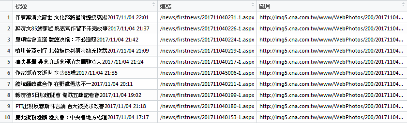

文字探勘
================

10/30練習題
-----------

``` r
## 1. 使用R內建的mtcars資料檔。
## 2. 建立一個羅吉斯迴歸模型，目標變數(Y)為手/自排(am)。
## 3. 針對建立的模型解釋其意義。

fit = glm(am ~ mpg + wt, data=mtcars, family="binomial")
summary(fit)
```

    ## 
    ## Call:
    ## glm(formula = am ~ mpg + wt, family = "binomial", data = mtcars)
    ## 
    ## Deviance Residuals: 
    ##      Min        1Q    Median        3Q       Max  
    ## -2.50806  -0.45191  -0.04684   0.24664   2.01168  
    ## 
    ## Coefficients:
    ##             Estimate Std. Error z value Pr(>|z|)  
    ## (Intercept)  25.8866    12.1935   2.123   0.0338 *
    ## mpg          -0.3242     0.2395  -1.354   0.1759  
    ## wt           -6.4162     2.5466  -2.519   0.0118 *
    ## ---
    ## Signif. codes:  0 '***' 0.001 '**' 0.01 '*' 0.05 '.' 0.1 ' ' 1
    ## 
    ## (Dispersion parameter for binomial family taken to be 1)
    ## 
    ##     Null deviance: 43.230  on 31  degrees of freedom
    ## Residual deviance: 17.184  on 29  degrees of freedom
    ## AIC: 23.184
    ## 
    ## Number of Fisher Scoring iterations: 7

使用油耗(mpg)及車重(wt)作為解釋變數，建立羅吉斯迴歸模型，預測車子為自排車或手排車(am)。

根據模型係數估計結果，發現油耗及車重的係數值皆為負值，表示油耗越高或是車重越重，該車款為手排車(am=1)的可能性越小。 但根據P值檢驗其顯著性，發現油耗對於預測手/自排車的影響並不顯著；而車重則有顯著影響。

車子重量每上升1單位(千磅)，該車款為手排車的可能性下降6.4倍。

### 補充

-   [資料預處理](補充_資料預處理.md)
-   [How I built a scraper to measure activity of MPs](http://www.maartenlambrechts.com/2016/10/03/how-i-built-a-scraper-to-measure-activity-of-mps.html)

網頁運作概論
------------

網頁其實就是一個儲存在電腦上的**檔案**，通常這個檔案的副檔名會是**.html**或**.htm**。 這種類型的檔案可以透過**瀏覽器**開啟檢視內容，或使用任何的文字編輯器(如：記事本、Notepad++)進行編輯。

看起來大概就像這個樣子……

    <html>
      <head>
        <title>網頁標題</title>
      </head>
      <body>
        網頁內容
      </body>
    </html>

我們所造訪的每個網站，都是一個或數個的網頁集合存放在各自的電腦裡，我們通稱這些提供服務的電腦為**伺服器(Server)**。

每當我們在瀏覽器上輸入目標網址，其實就是透過網路連結到對應的Server下載了這份網頁檔案，再由瀏覽器進行解析和呈現。

HTML
----

HTML(**H**yper**T**ext **M**arkup **L**anguage)，是一種標記語言，主要用途為網頁設計。我們可以使用**網頁瀏覽器**檢視HTML文件的解析內容。開發時則可使用任意文字編輯器編寫HTML。

HTML的基本組成元素是**標籤(tag)**，其形式為小於(&lt;)和大於(&gt;)符號包圍的一個關鍵字，例如：
<html>
。在標籤裡面，有時候也可以視需求加入標籤**屬性**。

以下為一個簡單的HTML範例，較完整的標籤列表可參考[w3schools](https://www.w3schools.com/tags/default.asp)。

    <html>
      <head>
        <title>世新大學新聞系</title>
      </head>
      <body>
        
        <br>
        <a href="http://shunews.shu.edu.tw/">世新大學新聞系</a>
        <ul>
          <li class="shu">最新消息</li>
          <li>關於我們</li>
          <li class="shu">課程規劃</li>
          <li>小世界周報</li>
        </ul>
      </body>
    </html>

XPath
-----

XPath是一種XML路徑語言(**X**ML **Path** Language)，可用於在XML文件中查詢所需資訊。

直接用幾個範例來理解XPath常用表達式：

-   [/html/body/img](#)
    -   最基本的XPath表達方式，從根節點開始依照路徑獲取img
-   [/html//a/@href](#)
    -   html下任意位置超連結的href屬性
-   [//\*\[@class='shu'\]](#)
    -   任意位置未知節點符合class屬性為shu者

新聞網爬蟲
----------

以[中央通訊社焦點新聞](http://www.cna.com.tw/list/firstnews-1.aspx)為例。

首先觀察網頁結構：

1.  在目標結點上點選**滑鼠右鍵**。
2.  選擇**檢查**。
3.  觀察可能的**XPath**表達式。
4.  使用R語言的**rvest**套件進行爬蟲。

``` r
## 安裝並載入rvest套件
##install.packages("rvest")
library(rvest)

## 讀取網頁內容
news_page = read_html("http://www.cna.com.tw/list/firstnews-1.aspx")

## 根據XPath獲取標題節點資訊
title_node = html_nodes(news_page, xpath="//*[@class='article_list']/ul/li/a")

## 擷取超連結文字
news_title = html_text(title_node)

## 擷取超連結的href屬性值
news_url = html_attr(title_node, name="href")

## 根據XPath獲取圖片節點資訊
img_node = html_nodes(news_page, xpath="//*[@class='list_pic']/img")

## 擷取圖片的src屬性值
img_src = html_attr(img_node, name="data-src")

## 轉成資料框架型態
data_news = data.frame(標題=news_title, 連結=news_url, 圖片=img_src)
View(data_news)
```


