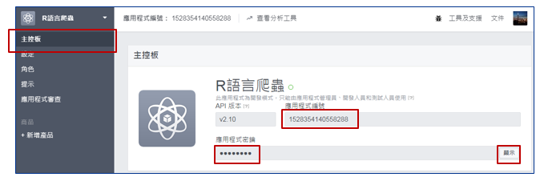

```{r setup, include=FALSE}
knitr::opts_chunk$set(echo = TRUE)
```

## PTT爬蟲

PTT是一個類似網路論壇的電子佈告欄系統(BBS, Bulletin Board System)，只要經過免費註冊，皆可在上面進行文章發表、雙向討論。

PTT現在也已經有網頁版，不一定要透過telnet連線使用，因此我們也可以使用一樣的網頁爬蟲技術擷取文章資訊：
[https://www.ptt.cc/bbs/index.html](https://www.ptt.cc/bbs/index.html)

以[TWICE](https://www.ptt.cc/bbs/TWICE/index200.html)看板為例，和上週爬蟲步驟相同，先透過檢視網頁元素的方式觀察目標對象的XPath規則：

1. **推文數：**//div[@class='nrec']
2. **文章標記：**//div[@class='mark']
3. **標題及連結：**//div[@class='title']/a
4. **發文日期：**//div[@class='date']
5. **作者：**//div[@class='author']

確定規則後剩下的就交給rvest套件即可。

```{r, eval=FALSE}
## 載入rvest套件
library(rvest)

## 讀取網頁內容
ptt_page = read_html("https://www.ptt.cc/bbs/TWICE/index200.html")

## 推文數
node_nrec = html_nodes(ptt_page, xpath="//div[@class='nrec']")
ptt_nrec = html_text(node_nrec)

## 文章標記
node_mark = html_nodes(ptt_page, xpath="//div[@class='mark']")
ptt_mark = html_text(node_mark)

## 標題
node_title = html_nodes(ptt_page, xpath="//div[@class='title']/a")
ptt_title = html_text(node_title)

## 網址
node_url = html_nodes(ptt_page, xpath="//div[@class='title']/a")
ptt_url = html_attr(node_url, name="href")

## 發文日期
node_date = html_nodes(ptt_page, xpath="//div[@class='date']")
ptt_date = html_text(node_date)

## 作者
node_author = html_nodes(ptt_page, xpath="//div[@class='author']")
ptt_author = html_text(node_author)

## 轉成資料框架型態
ptt_TWICE = data.frame(
  推文數 = ptt_nrec,
  文章標記 = ptt_mark,
  標題 = ptt_title,
  網址 = ptt_url,
  發文日期 = ptt_date,
  作者 = ptt_author
)
View(ptt_TWICE)
```

### 補充

- [多頁爬蟲](補充_多頁爬蟲.md)
- [儲存文章爬蟲內容至本機電腦上](補充_儲存文章爬蟲內容至本機電腦上.md)
- [年齡分級機制看板](補充_年齡分級機制看板.md)

## Facebook爬蟲

想要抓取Facebook上的資料，需要透過Facebook本身提供的API作為介接。首先進入Facebook開發人員網頁，登入後(若首次使用可能需要先行註冊)點選**新增應用程式**，輸入圖形驗證碼：
[https://developers.facebook.com/](https://developers.facebook.com/)


點選左上角選單中的主控板，畫面會顯示這個應用程式的編號及密鑰，這也就是我們將要拿來驗證身份的重要資訊。點選**顯示**按鈕，將專屬的**應用程式編號**和**應用程式密鑰**記錄下來。



安裝並載入Rfacebook套件。使用fbOauth()函數向Facebook提出授權需求，經驗證後可得到一個權杖(token)，允許使用者存取特定資源。

```{r, eval=FALSE}
## 安裝並載入Rfacebook套件
##install.packages("Rfacebook")
library(Rfacebook)

## 取得存取權杖
fb_oauth = fbOAuth(app_id = "1528354140558288",
                   app_secret = "b84xxxxxxxxxxxxxxxxxxxx61f")
```

如果操作無誤的話應該會出現以下訊息：

> Copy and paste into Site URL on Facebook App Settings: http://localhost:1410/ 
> When done, press any key to continue...

回到Facebook開發人員頁面，點選左側選單中的**新增產品**。點選Facebook登入的**設定**按鈕。


複製前一步驟提示訊息中的網址，貼至**用戶端OAuth設定** -> **有效的OAuth重新導向URI**，完成後儲存變更。


回到R主控台，按下任意鍵，若一切設定無誤，將會自動開啟瀏覽器至Facebook的確認畫面。點擊確認繼續後，出現完成訊息，即可關閉瀏覽器。

到這邊就已經完成Facebook API的設定了，剩下的就只是利用Rfacebook套件提供的介接函數去抓取我們想要的資訊了。

- 使用getPage()函數取得指定頁面資訊，頁面需為設定為公開的專頁，其中token即為我們所取得的權杖。
- 使用getPost()函數取得指定貼文資訊，其中post為前一步驟中取得的文章id；而reactions若設定為TRUE則可獲取該篇貼文的迴響類型(LIKE, LOVE, WOW, SAD…)。

```{r, eval=FALSE}
## 取得公開的頁面資訊
fb_page = getPage(page="imayday555", token=fb_oauth, n=50)
View(fb_page)
```


```{r, eval=FALSE}
## 取得公開的文章資訊
fb_post = getPost(post=fb_page$id[1], token=fb_oauth, reactions=TRUE)
View(fb_post$comments)
View(fb_post$reactions)
```


## 小試身手

運用爬蟲技術爬取任何你有興趣的主題內容，不限一般網頁、PTT、Facebook等。

把你的程式碼存為**學號.R**，夾帶附件mail至[ytshen1207@gmail.com](mailto:ytshen1207@gmail.com)。 信裡面註明你的**姓名、學號**以及**爬蟲結果的擷圖**。
